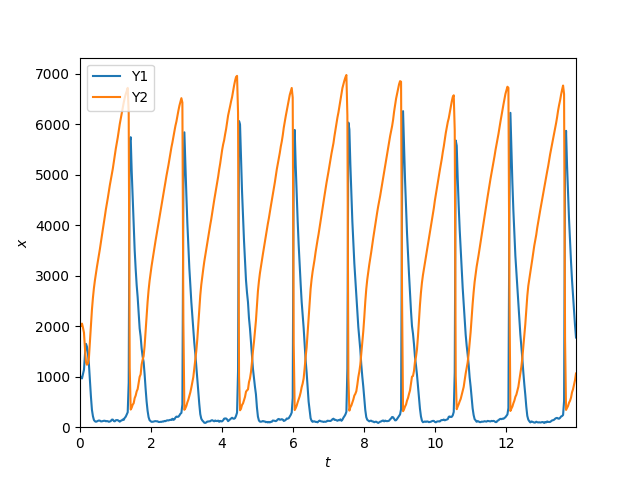

# SSM: Stochastic simulation methods

A library for simulating stochastic processes that consist of reactions.
A reaction is described by a list of reactants, products and an associated reaction rate.
This library contains implementation of SSA [[1]](#1), tau-leaping [[2]](#2) and R-leaping [[3]](#3).

## Installation

### From the source code

SSM requires c++20.

```shell
git clone https://github.com/amlucas/SSM.git --recursive
cd SSM
mkdir build
cd build
cmake ..
make -j
make test
```

### From pip

If only the python interface is required, `pyssym` can be installed from pip.

```shell
python3 -m pip install pyssym
```


## Running a simulation

### From the c++ executable

Simulations are described in a json file (see the `examples` directory).
They are composed of a solver (e.g. the SSA algorithm), a list of reactions, the initial conditions, and extra parameters such as the number of runs and the simulation time.
In addition, diagnostics can be attached to the simulation to information.

Running and plotting the results of the Brusselator example:
```shell
./build/apps/run_simulation examples/brusselator.json
./tools/plot_mean_trajectories.py brusselator.csv --show-only Y1 Y2
```




### With python bindings

See [python examples](apps/python).


## Reaction syntax

Reactions are fully described by a rate and a string that describe the reactant and product names as well as their stoichiometric coefficients.

Example of valid reactions:
```json
{
    "reactions": [
        {"rate": 0.1, "reaction": "[X1] -> Y1"},
        {"rate": 0.1, "reaction": "[X2] + Y1 -> Y2 + Z1"},
        {"rate": 0.00005, "reaction": "2 Y1 + Y2 -> 3 Y1"},
        {"rate": 5, "reaction": "Y1 -> Z2"}
    ]
}
```

The brackets (e.g. in `[X1]`) indicate that the species is a reservoir.
During the simulation the quantity of the species `[X1]` will not change.


## Structure of this repository

* apps: source code for standalone executables.
* source: source code of the SSM library.
* examples: example json file of stochastic simulations.
* extern: external dependencies required by the SSM library.
* tests: unit tests for the SSM library.
* tools: additional helper tools for e.g. plotting the results of a simulation.

## References

<a id="1">[1]</a> 
Gillespie, D. T. (1977). 
Exact stochastic simulation of coupled chemical reactions. 
Journal of Physical Chemistry, 81(25), 2340–2361. 
https://doi.org/10.1021/j100540a008

<a id="2">[2]</a> 
Cao, Y., Gillespie, D. T., & Petzold, L. R. (2005). 
Avoiding negative populations in explicit Poisson tau-leaping. 
Journal of Chemical Physics, 123(5). 
https://doi.org/10.1063/1.1992473


<a id="3">[3]</a> 
Auger, A., Chatelain, P., & Koumoutsakos, P. (2006). 
R-leaping: Accelerating the stochastic simulation algorithm by reaction leaps. 
Journal of Chemical Physics, 125(8). 
https://doi.org/10.1063/1.2218339


